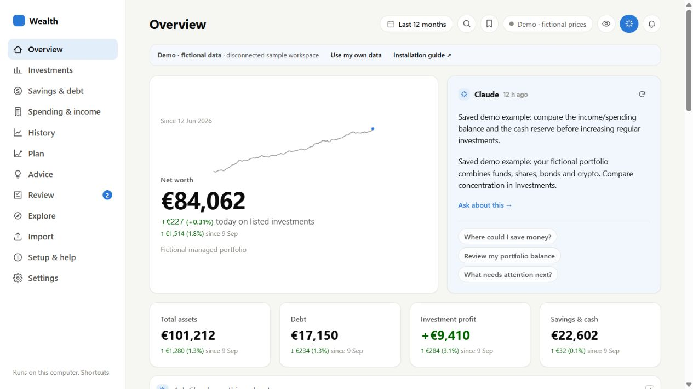
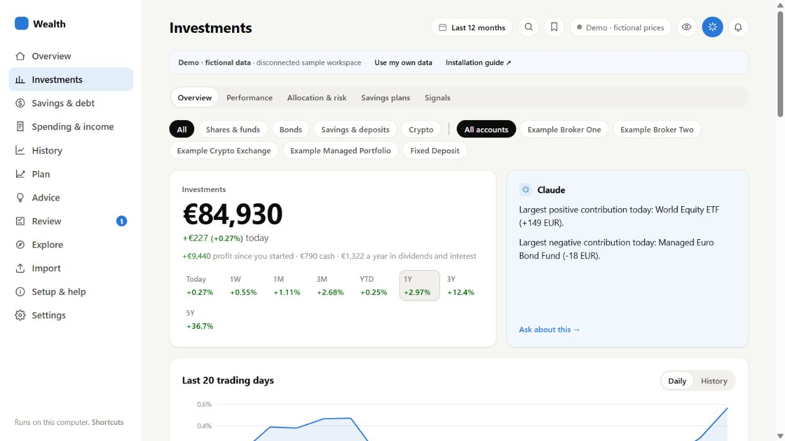
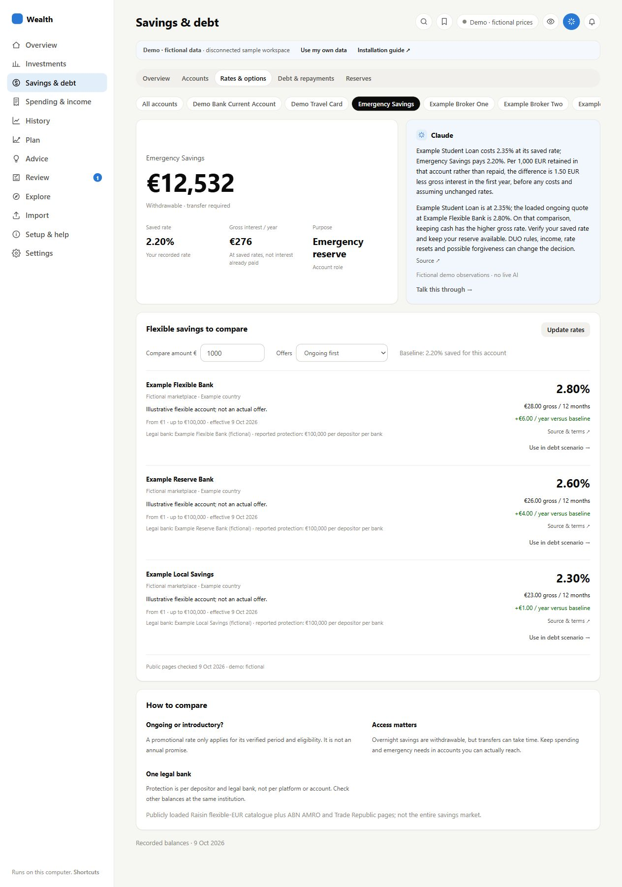
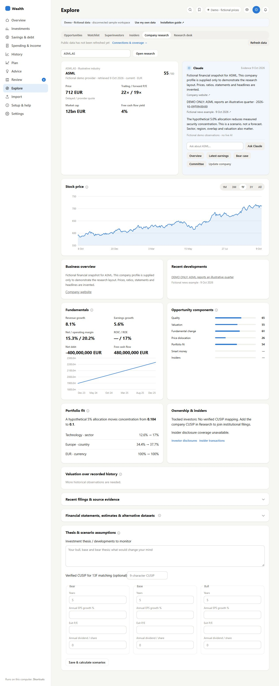

# Wealth dashboard — try the demo, then make it yours

A local wealth dashboard for investments, spending, flexible cash, debt, recurring investment plans, invoices and research. This public edition includes the current application design and a rich **fictional** dataset. No private database, statements, original financial history or credentials are included.

## Start here

1. [Download the ZIP](https://github.com/jcveraart/Wealth-dashboard-test/archive/refs/heads/main.zip), then **Extract All**.
2. Install [Python 3.11 or 3.12](https://www.python.org/downloads/) if needed. The offline demo supports Python 3.9+.
3. **Windows:** double-click `start-demo-windows.bat`. **macOS/Linux:** run `python3 demo.py` from the extracted folder.
4. Open **http://127.0.0.1:8051**. The normal launcher runs in the background, so its terminal can close after startup.
5. Explore the demo. When ready, choose **Use my own data → Start my personal workspace**. It opens separately on port 8052, with no sample financial records.

The demo needs no AI account, API key, bank login, cloud database or package installation. It stays disconnected and labels fictional prices, news, rates and saved chat examples. Real imports and connections belong in the personal profile.

## Complete guides

- [Installation, personal-mode transition, updates and troubleshooting](docs/INSTALLATION.md)
- [All optional connections, setup steps, costs and privacy](docs/CONNECTIONS.md)
- [Screenshot tour of pages and features](docs/SCREENSHOTS.md)
- [Application walkthrough](docs/APP_GUIDE.md)
- [Data format](DATA.md), [investment research](INTELLIGENCE.md), [connected workflows](WORKFLOWS.md)

The same installation guide is accessible inside the app through **Setup & help**.

## What you can explore

| Area | Highlights |
|---|---|
| Overview | Net worth with an internal sparkline, spending/investment summaries and the soft-blue briefing card |
| Investments | Asset/account filters, Daily/History charts, comparisons, allocation, risk, holdings and recurring savings plans |
| Spending & income | Account/category views, transactions, receipts, subscriptions, trips, countries, review and compact payment-popup sorting |
| Savings & debt | Account purpose/access, known versus idle/unknown rates, earnings evidence, flexible-rate comparisons, reserves and fair repayment scenarios |
| Explore | Opportunities, watchlist, investor/insider disclosure views, company-price chart, financials and contextual conversation |
| Documents | Invoice products traced to existing payments; invoices do not create duplicate payments |
| Plan & Advice | Goals, budgeting, decision records, recommendations, questions and next steps |
| Import & Review | Document/CSV import, supported previews, duplicate checks, coverage and Undo |
| Settings | Provider setup, source coverage, data export, optional cloud copy and backups |

The sample includes several years of dated history, hundreds of payments, multiple investment accounts, shares/funds/bonds/crypto, cash, debt, plans, a linked product invoice and an illustrative company dossier. Some disclosure-dependent metrics intentionally stay unavailable rather than inventing evidence.

## A few highlights









[See all 17 screenshots and what each feature does →](docs/SCREENSHOTS.md)

## Personal use

Personal data lives in `.personal-runtime/`, not in the versioned sample folder. Start with `personal.py`, enable desired features in **Setup & help**, and configure your own providers in Settings. Install optional dependencies with `python install.py` or `install-optional-windows.bat` first.

There is no direct bank-login or trade-execution connector: import your own supported exports/statements and confirm the results. Public market and savings data do not access your bank. AI sends the selected question/document/context to the provider you enable. Supabase is an optional copy in your own project, not a requirement. No connection or key is supplied by the author.

## Day-to-day commands

```text
python demo.py                          # disconnected example workspace
python personal.py                      # separate empty/persistent workspace
python launch.py demo --command stop
python launch.py personal --command stop
python launch.py personal --command restart
python demo.py --port 8053               # choose another demo port
python demo.py --reset                    # preserve old demo, regenerate samples
python demo.py --foreground --no-browser # development server; keep terminal open
```

Resetting demo data cannot reset personal data. Updates copy source into each runtime and preserve existing records. Back up your personal workspace before major updates or moving computers.

## Privacy and sharing

Share this repository or its ZIP. **Do not share** personal runtimes, statements, credentials, settings, cache, logs or financial backups. These are ignored by Git. Sample data in `demo_data/` is generated from fictional parameters and is intentionally versioned. The app binds to 127.0.0.1; it is a local, single-user application, not an internet-hosted financial service.

## Development

Run `python -m unittest discover -s tests`; JavaScript checks use Node if installed. CI checks tests and public-file hygiene without provider credentials. Optional provider connections require your own setup and are not validated by publishing this repository. Public source provenance is recorded in `release.json`.
