# Screenshot walkthrough

All 17 screenshots were captured from this public build using a fresh download. Financial records, rates, prices, news and company figures are fictional; the personal-setup screenshot shows an empty test profile. No private dashboard, bank statement or credential was photographed.

Follow the [installation guide](INSTALLATION.md) first. The [connections guide](CONNECTIONS.md) explains provider setup, cost/access requirements and what data leaves your computer. Light/dark appearance follows your selected theme; the layout is the same.

## Overview: your whole dashboard

Open Overview. The top card combines net worth and a small history graph; the briefing sits beside it. Further down, summaries link spending, investments, cash, goals and advice.

## Investments: compact daily view

Open Investments → Overview. Asset classes and relevant accounts filter the same selection. Daily/History switches change the chart without changing your recorded holdings.

## Performance: evidence before return figures

Choose Performance. Recorded account values can be charted immediately. Adjusted returns remain unavailable until external-flow coverage is confirmed; this sample intentionally demonstrates that safeguard.

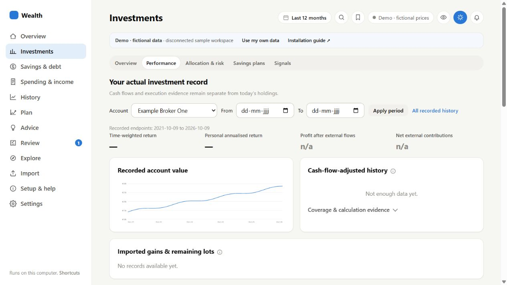

## Allocation and portfolio risk

Choose Allocation & risk. Compare concentration, sector/region/currency proxies and a covered-holdings risk model. A modeled basket is distinct from the return of your actual trades.

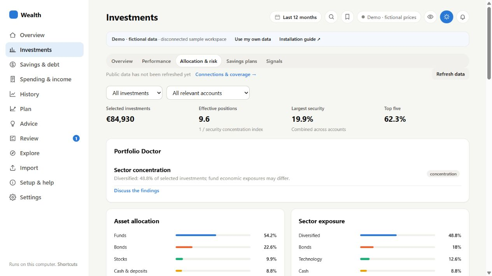

## Recurring investment plans

Choose Savings plans. See each amount, frequency, account, monthly equivalent and next execution. Add/Edit changes dashboard records; it never places orders with a broker.

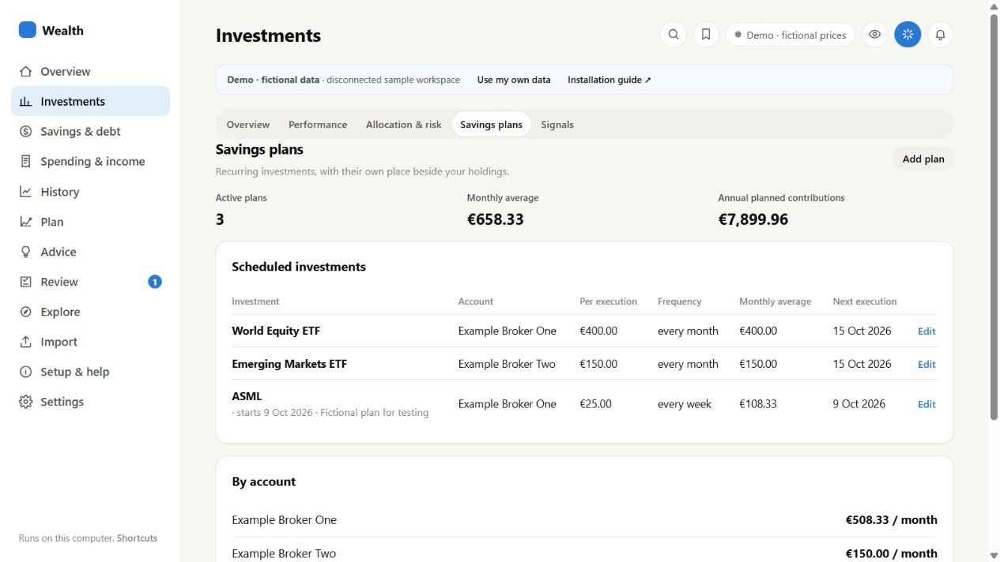

## Cash: location, earnings and reserves

Open Savings & debt → Overview. Flexible balances, saved rates, idle cash, reserves and debt sit together. Fixed deposits and securities stay in Investments.

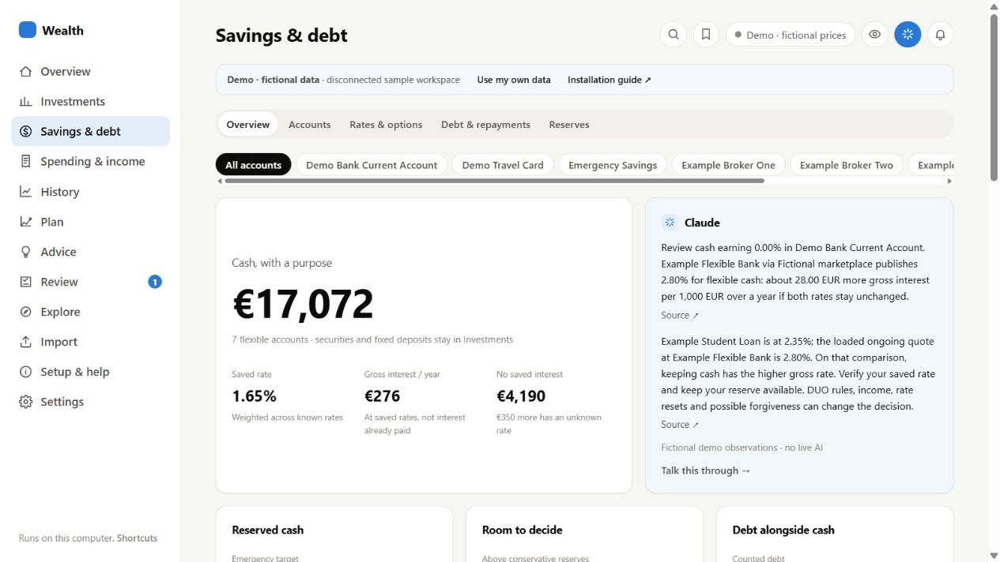

## Cash: an individual account

Choose Accounts and select Emergency Savings. Details include balance dates, access, purpose, saved rates and earnings. Scroll down for balance history and evidence; unknown protection or interest-paid figures stay unknown.

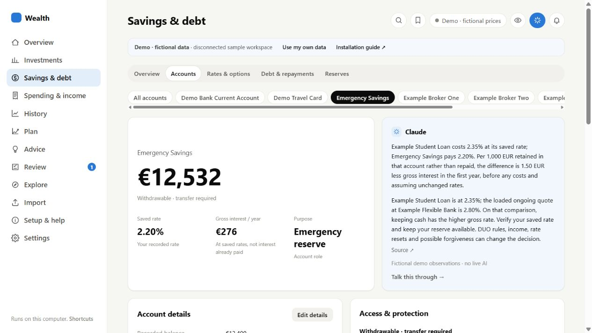

## Flexible rates and promotions

Choose Rates & options. Compare an amount and baseline rate, and decide whether to include introductory offers. These demo banks and quotes are fictional. Personal live mode retrieves supported public product pages.

## Debt: compare keeping cash with repayment

Choose Debt & repayments, enter an amount and select Compare choices. Both paths use the same upfront money and monthly budget. The graphs illustrate constant-rate assumptions; they do not change balances or model future DUO forgiveness.

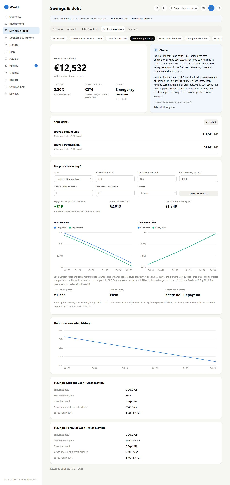

## Spending and income together

Open Spending & income → Overview. Change account chips and date range, then inspect categories or monthly bars. Internal transfers should be classified separately from spending.

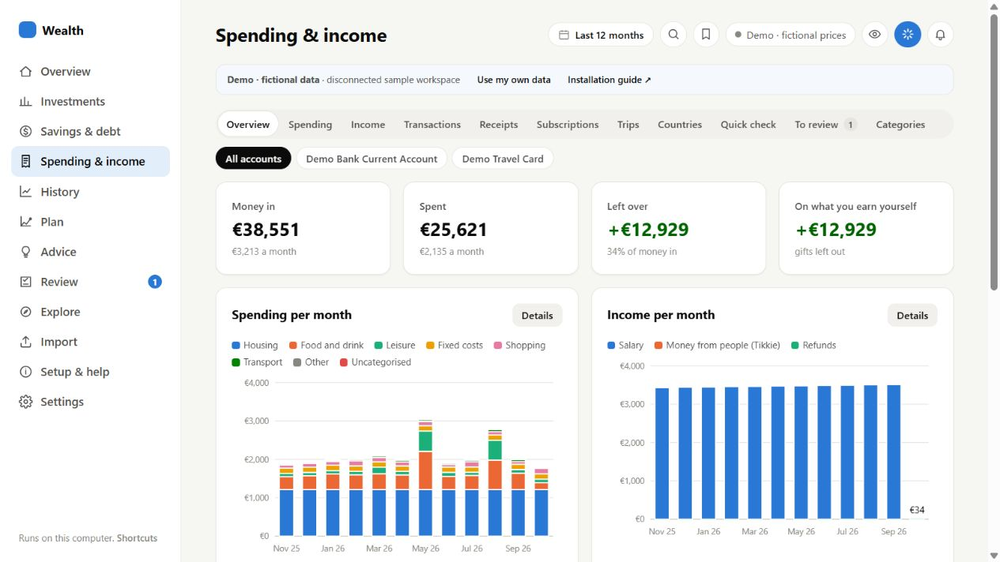

## A small payment drilldown

Click a spending category. The popup has just Sort by (Date/Amount) and Ascending/Descending. Open in Transactions carries the selection into the full transaction view.

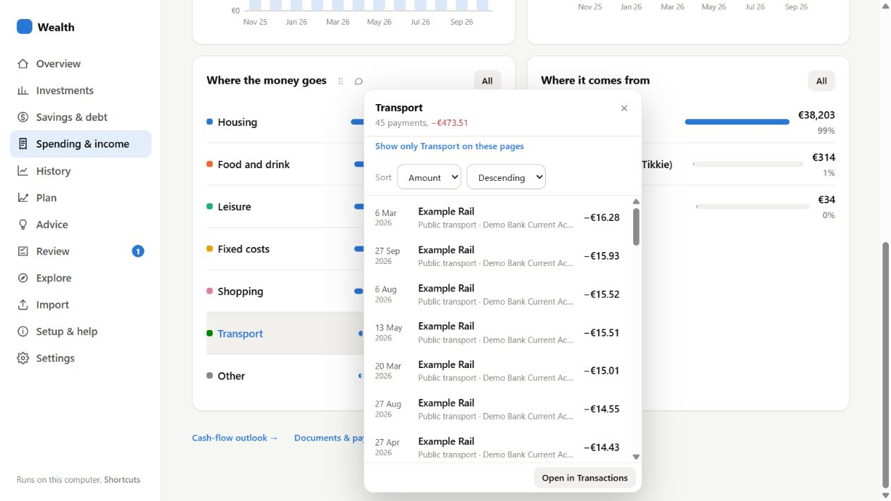

## Income sources and history

Choose Income in Spending & income. Monthly history, sources and recorded incoming transactions remain under the same navigation and account chips.

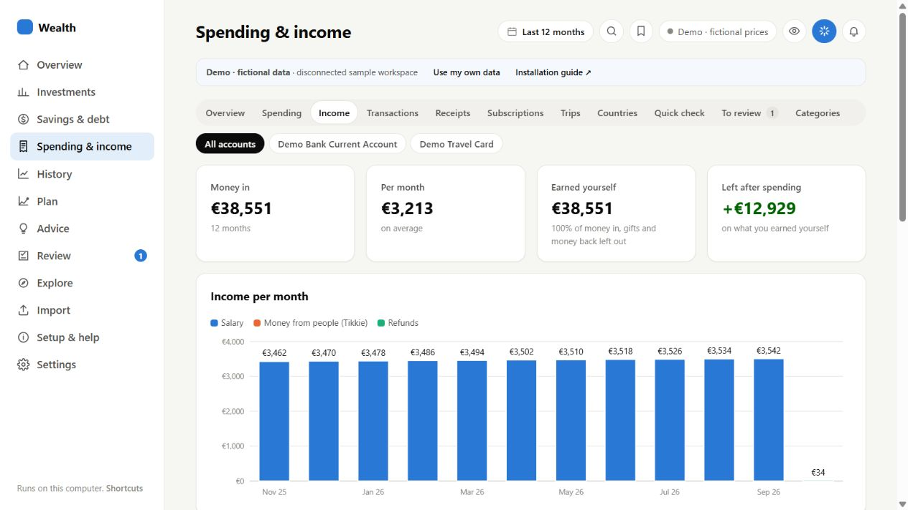

## Invoice products linked to one payment

Choose Receipts and open Example Demo Shop. Two fictional products reconcile to one €84 payment. Product categories can split that existing payment without creating another expense; keep source evidence attached.

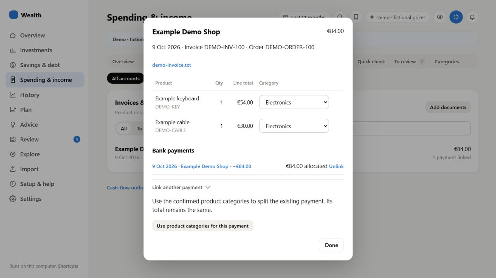

## A company dossier with an ordinary price chart

Open Explore → Company research, type ASML.AS and select Open research. The demo includes fictional financials, news and daily closes. The blue observations card can start a scoped conversation in personal mode once AI is connected.

## Imports, provider selection and coverage

Open Import. Claude/OpenAI switches choose the configured importer. Download the marked sample CSV from Setup & help to try a deterministic import without AI. Recognised bank CSVs apply directly with a summary and Undo; review the resulting records.

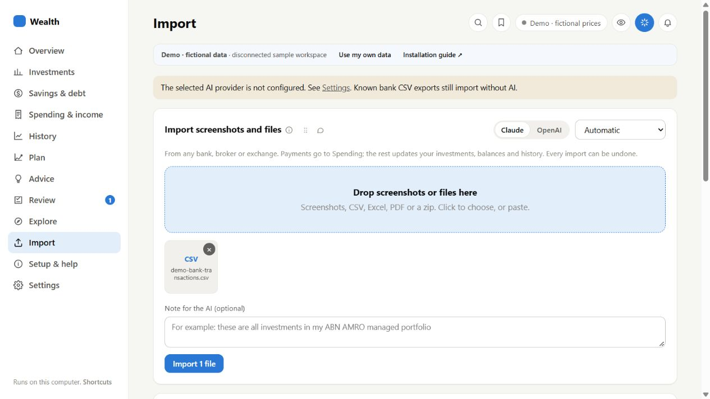

## Try first, then choose your own workspace

Open Setup & help. The demo tour and sample download need no account or packages. Start my personal workspace creates/reopens a different data folder instead of mixing real records with examples.

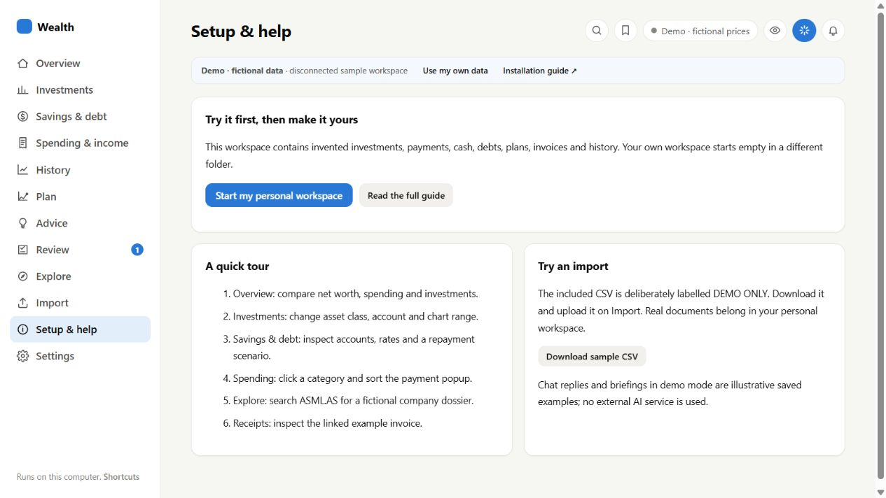

## Personal mode: empty and opt-in

The separate personal workspace starts with no sample financial records. Install optional packages, choose desired features, save/restart, then configure your own providers. Leave unwanted connections disabled.

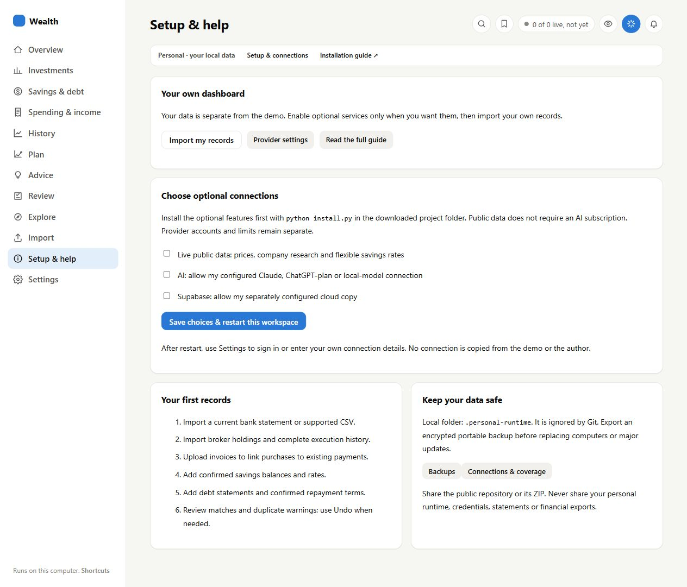
